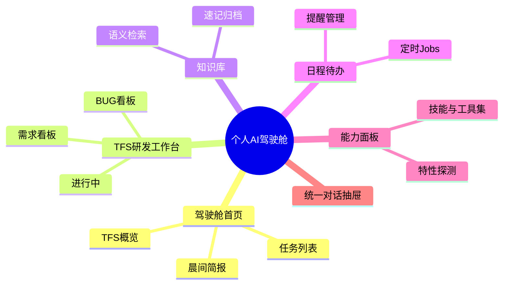
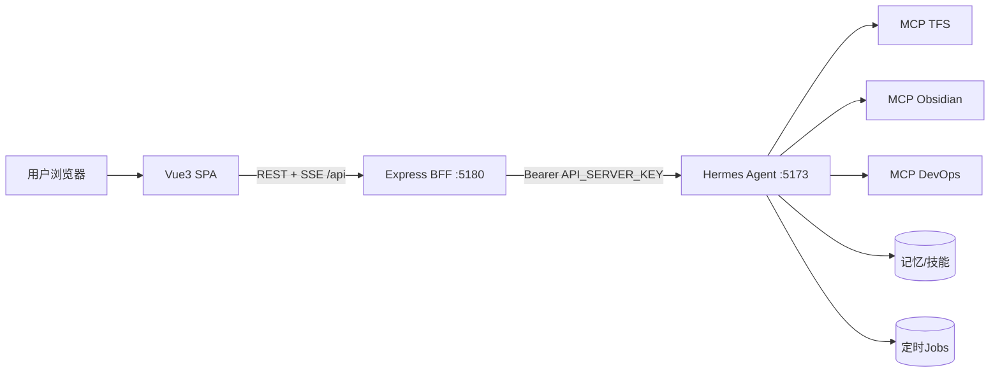
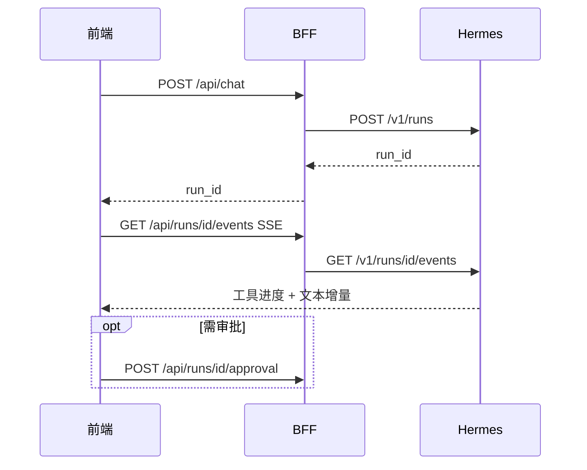

# 个人 AI 驾驶舱 — 设计文档

> 以本地 **Hermes Agent** 为统一 AI 引擎与工具编排中枢的网页端个人工作辅助系统。

| 项 | 内容 |
| --- | --- |
| 文档版本 | v1.0 |
| 状态 | 已实现 MVP |
| 仓库路径 | `e:/ai-cockpit-hermes` |
| AI 引擎 | Hermes Agent (Nous Research) |
| 前端 | Vue 3 + Vite + TypeScript + Pinia + Naive UI |
| 后端 | Node.js + Express (BFF 安全代理) |

---

## 1. 背景与问题

日常研发工作分散在多个系统：

- **TFS**：需求、BUG、排期、周报
- **Obsidian SecondBrain**：知识沉淀与检索
- **个人日程/待办**：提醒与计划

在系统间反复切换、手工搬运信息，占用大量时间。本机已部署 **Hermes Agent**——具备持久记忆、技能自进化、MCP 工具接入、7×24 常驻能力，并暴露 **OpenAI 兼容 HTTP API**，适合作为「驾驶舱」的统一智能中枢。

## 2. 产品目标

| 目标 | 描述 |
| --- | --- |
| 一屏纵览 | 打开即见今日待办、TFS 任务、超期提醒、知识摘要 |
| 一句话办事 | 自然语言驱动 Hermes 调用 TFS / Obsidian 等工具 |
| 主动辅助 | 定时 Jobs 生成晨间简报、超期提醒 |
| 沉淀记忆 | 依托 Hermes 长期记忆，越用越懂用户偏好 |

## 3. 非目标

- 不做多用户/团队协作版（单机个人使用）
- 不替代 TFS / Obsidian 本体，仅做聚合与编排层
- 不在浏览器内托管大模型（由 Hermes 侧配置）
- 不做原生移动 App（响应式网页；移动触达可借 Hermes 的 Telegram 等）

## 4. 核心决策

| 决策点 | 选择 | 理由 |
| --- | --- | --- |
| AI 媒介 | Hermes Agent | 本地自主智能体，支持 MCP、记忆、Jobs、SSE |
| 工具编排 | **统一走 Hermes** | TFS/Obsidian/DevOps 作为 MCP 接入，驾驶舱只对接一个口 |
| 前端栈 | Vue 3 + Naive UI | 团队熟悉、适合仪表盘与暗色主题 |
| 安全架构 | **BFF 代理** | Hermes API 含终端等高危工具，密钥不能进浏览器 |
| 包管理 | npm workspaces | 与 pnpm 等价，免额外安装 |

## 5. 产品形态

单页应用（SPA）：**左侧导航 + 主区卡片/看板 + 右侧全局对话抽屉**。



### 5.1 模块说明

#### A. 驾驶舱首页

- TFS 待处理数量（待办 / BUG / 超期）
- 我的研发任务列表（最多 8 条）
- 后续：晨间简报卡（Hermes 定时 Job 产物）

#### B. TFS 研发工作台

- 三列看板：我的需求 / 进行中 / 我的 BUG
- 写操作通过对话抽屉 + 审批门禁完成

#### C. 知识库（Obsidian）

- 语义检索 Vault，卡片展示标题、路径、摘要
- 归档能力经对话 + Obsidian MCP（后续增强一键归档）

#### D. 日程待办 / Jobs

- 创建、暂停、恢复、立即执行、删除 Hermes 定时任务
- 典型场景：工作日 9:00 拉取超期需求并生成提醒

#### E. 能力面板

- 展示 `/v1/capabilities`、`/v1/skills`、`/v1/toolsets`
- 用于确认 Hermes 版本能力与 MCP 是否加载

#### F. 统一对话抽屉（全局）

- 快捷键 `Ctrl/Cmd + K` 唤起
- Runs + SSE 流式输出，实时展示工具调用进度
- 支持停止生成、审批确认（高危操作）

### 5.2 用户故事与验收

| 编号 | 用户故事 | 验收标准 |
| --- | --- | --- |
| US-1 | 打开驾驶舱看到今日 TFS 任务 | 首页卡片经 Hermes→TFS MCP 返回数据 |
| US-2 | 一句话查「这周超期需求」 | 对话抽屉流式返回，可在 TFS 页查看 |
| US-3 | 把结论归档到知识库 | Obsidian Vault 出现规范笔记 |
| US-4 | 每天早上收到晨间简报 | 定时 Job 按时生成并展示 |
| US-5 | 危险操作需确认 | 审批弹窗，确认后才执行 |

## 6. 系统架构



### 6.1 分层职责

| 层 | 组件 | 职责 |
| --- | --- | --- |
| 表现层 | Vue3 SPA | 仪表盘、对话、各业务页面；只访问 BFF |
| 接入层 | BFF | 持有密钥、SSE 透传、CORS、可选鉴权、静态托管 |
| 引擎层 | Hermes | LLM + 工具编排 + 记忆 + Jobs |
| 工具层 | MCP Servers | TFS / Obsidian / DevOps 等 |
| 数据层 | 业务系统 | TFS、Vault、DevOps 平台 |

### 6.2 为何需要 BFF

Hermes API Server 开放**包括终端命令在内的全部工具**。`API_SERVER_KEY` 在任何部署（含 `127.0.0.1`）都必须携带。若浏览器直连：

- 密钥暴露在前端，等同交出本机终端执行权
- 需开放 CORS，扩大攻击面

BFF 实现：密钥隔离、最小暴露、统一治理、端点裁剪。

## 7. 数据流

### 7.1 对话主链路



### 7.2 首页聚合

前端请求 `GET /api/dashboard` → BFF 调 Hermes `chat/completions`（带结构化 system 提示）→ Hermes 调 TFS MCP → 返回 JSON 卡片数据。

## 8. UI 设计规范

```
┌──────────────────────────────────────────────────────────┐
│ Topbar: 标题 | Hermes状态灯 | 对话按钮(Ctrl+K)              │
├────────┬───────────────────────────────────┬─────────────┤
│ 左导航  │        主内容区(卡片/看板)        │  对话抽屉    │
│ 驾驶舱  │                                   │  (可收起)    │
│ TFS    │                                   │             │
│ 知识库  │                                   │             │
│ 日程   │                                   │             │
│ 能力   │                                   │             │
└────────┴───────────────────────────────────┴─────────────┘
```

- 深色主题为主，卡片化布局
- 超期=红、进行中=蓝、完成=绿
- 工具调用以 Tag/气泡展示，降低黑盒感
- 窄屏时对话抽屉全屏覆盖

## 9. 安全与隐私

| 风险 | 措施 |
| --- | --- |
| 密钥泄露 | `HERMES_API_KEY` 仅 BFF `.env` |
| 终端滥用 | Hermes 绑 `127.0.0.1`，仅 BFF 可达 |
| 误操作 | approval 门禁 + 前端二次确认 |
| 数据外泄 | 全本地，Hermes 无遥测 |

## 10. 里程碑

| 阶段 | 范围 | 状态 |
| --- | --- | --- |
| M0 | BFF 骨架 + 健康灯 + 能力探测 | ✅ 已完成 |
| M1 | 对话抽屉 + 首页 TFS 卡 | ✅ 已完成 |
| M2 | TFS 写操作 + 审批对齐 | 🔄 待联调 Hermes 实测 |
| M3 | 知识库归档增强 | 📋 规划中 |
| M4 | 晨间简报 Job + 展示 | 📋 规划中 |
| M5 | 体验打磨、降级、响应式 | 📋 规划中 |

## 11. 风险与依赖

- Hermes 需在 **WSL2** 运行（Windows 原生支持实验性）
- MCP 须在 Hermes 可达环境内可执行
- Hermes 与 Vite 开发端口不可冲突（当前 Hermes **5173**、前端 **5174**）
- 不同 Hermes 版本 SSE 事件字段可能差异，需 `/v1/capabilities` 探测降级

## 12. 参考

- [Hermes Agent 文档](https://hermes-agent.nousresearch.com/docs/)
- [API Server](https://hermes-agent.nousresearch.com/docs/user-guide/features/api-server)
- 交互参考：Open WebUI、LobeChat（OpenAI 兼容对话前端范式）
